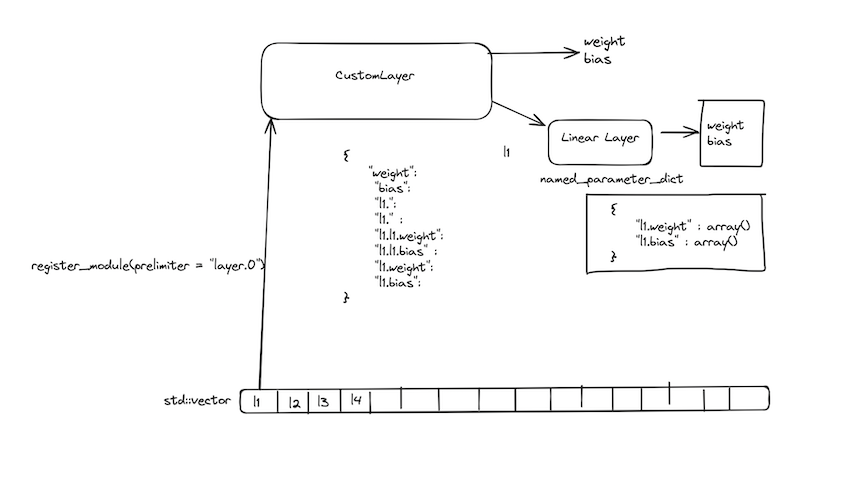

## Introduction

In the ever-evolving world of machine learning and artificial intelligence, new technologies is coming everyday especially in ML and AI space. This is where the [WasmEdge](http://wasmedge.org/) projects especially [LLAMAEdge](https://llamaedge.com) comes into play. WasmEdge NN plugins provides support to run LLM models like LLAMA and others on edge devices like Apple M series MacBooks. This lead to my project, where I had to build a plugin to integrate the mlx.cpp library into the WasiNN plugin ecosystem.

[mlx.cpp](http://github.com/ml-explore/mlx), a cutting-edge machine learning framework developed by Apple ML Research, is designed to provide a flexible and efficient platform for implementing and deploying machine learning models, and the ability to extend its functionality through custom modules is a game-changer.

## The Challenge

The first task was to create a custom module `mlx_llm.cpp` that would allow [MLX](http://github.com/ml-explore/mlx) to load models like llama and phi3 on c++ api for MLX framework. This involved diving deep into the core architecture of MLX and understanding how its various components interact with each other. Also I had to refer the implementation of frontend APIs of PyTorch and others to understand the inner workings of C++ based modules in  loading weights from formats like GGUF and SafeTensors.

The goal was to extend the capabilities of WasiNN by building a custom module that would allow the framework to handle LLM models using operations of [mlx.cpp](http://github.com/ml-explore/mlx), thus boosting the speed of ops computed on Mac Devices. This involved not only understanding the intricacies of WasmEdge and WasiNN but also navigating the complex landscape of [mlx.cpp](http://github.com/ml-explore/mlx) and edge computing.

## The Process

The first step was to familiarize myself with the existing codebase and documentation. MLX is built using modern C++ and leverages advanced techniques like template meta-programming and Metal acceleration. While this presented a steep learning curve, the comprehensive documentation and supportive community made the journey smoother. I would also like to thank MLX maintainers, especially @awni for supporting my work and providing guidance along the way.
After gaining a solid understanding of the framework, I started designing the custom module. This involved defining the module's interface, data structures, and algorithms. I had to ensure that the module would seamlessly integrate with the existing MLX ecosystem while providing the desired functionality.
One of the challenges I faced was implementing the custom module in a way that would not compromise the performance and efficiency of MLX. This required careful optimisation and profiling to identify and address potential bottlenecks.

After that the task was to complete the mlx_llm.cpp  library, use it as a separate dependency for WasmEdge project. Then I added files `mlx.h` and `mlx.cpp` for using the model in the Wasi-NN plugin that can now be accessed by the usage of the framework.

## Benchmarking:

The sample example built using the mlx_llm.cpp library API was able to provide important differences between the speeds of python and CPP API on MLX and thus improving the ecosystem for the whole new projects that are going to come in the future. 

The speed up even if it is for a small neural network is worth saying and could lead us to better performant edge nn than llama.cpp in future. Sadly I am not able to complete the complete implementation of an LLM model like phi3 (under progress) with the new library and thus we need more time for comparing token speeds of both the ecosystems i.e. mlx_llm.cpp and llama.cpp .

## My contributions:

1. https://github.com/WasmEdge/WasmEdge/pull/3330
2. https://github.com/guptaaryan16/mlx_llm.cpp

## The Result:

After several iterations of development, testing, and refinement, I successfully created a custom module that met the project requirements. The module not only extended MLX's capabilities but also demonstrated the framework's flexibility and extensibility.
Throughout the process, I had the opportunity to collaborate with experienced developers and researchers from the MLX team. Their guidance and feedback were invaluable in shaping the final product and helping me grow as a developer.

## What is left ;-/

Some parts are still left in the implementation but I am charged up to complete them and submit ship some cool example as soon as possible.

1. Completing the cmake for the mlx_llm.cpp so that it can be loaded as a dependency directly in WasmEdge and preparing a demo
2. Completing the implementation of phi3.cpp as a showcase of capabilities for  WasmEdge using the mlx_llm.cpp API
3. Collecting important benchmarks for both the libraries

## Conclusion

My experience with the LFX program was truly rewarding and eye-opening. It allowed me to push the boundaries of my knowledge and skills while contributing to a cutting-edge machine learning framework. The project not only showcased the power of MLX but also highlighted the importance of open collaboration and knowledge sharing in the field of artificial intelligence and edge libraries like WasmEdge.

## Thanks to the communities

Both MLX and WasmEdge are amazing communities with great maintainers like @awni and @hydai, who both supported me a lot in the project. The difficulty of the project was on a whole new level for me and to achieve something like a new library in c++ and a plugin for that calls for the amount of work and the fun I had while working on this.

P.S. The Project still requires some good amount of work to be completed for a cool demo on WasmEdge, so hope that I will complete it as soon as possible.
